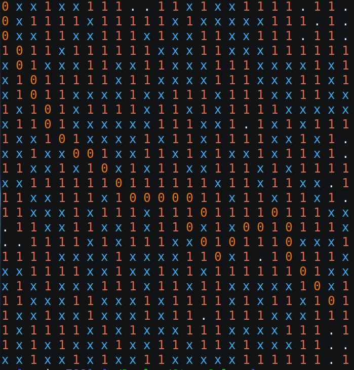
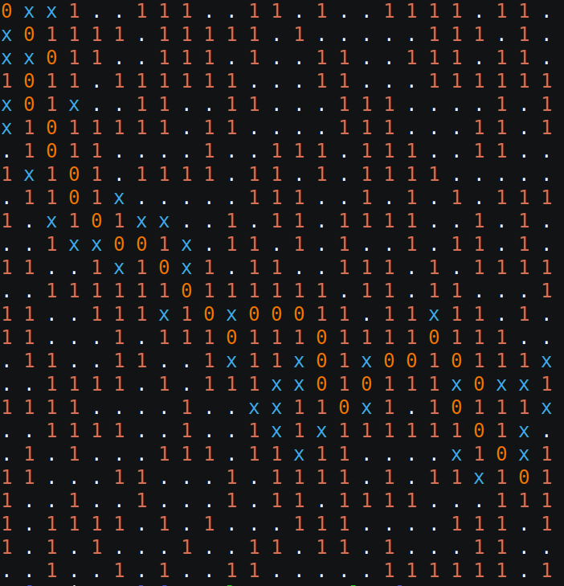

# Star_Solver

This program will print out the shortest path so long as a path exists\n
Pass a file consisting of a binary matrix as well as two tuples 'x,y' for points A and B

Below are two traversals of a matrix, the first using Dijkstra's algorithm and the second using the A\* algorithm. One can clearly see the space complexity differences of Dijsktra's vs A\*; Dijkstra's considers virtually all tiles, whereas A\* uses an optimal amount, so long as our heuristic function is consistent\*. Tiles that have been expanded by the algorithm are shown in blue

x (Blue) - Expanded node not on the optimal path

0 (Orange) - Expanded not that is on the optimal path

1 (Red) - Obstacle tile; non-traversable space

. (White) - Open tile; traversable space

As you can see, Dijkstra's algorithm expands virutally all tiles in the matrix, giving us a space complexity of ~O(n^2).

A\*, on the other hand, expands an optimal amount of tiles.
